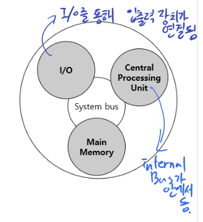

# 컴퓨터구조

## 1. 컴퓨터의 조직과 기능

### 1. 컴퓨터의 기능

* 데이터 처리 - CPU
* 데이터 저장 - M.M(Main memory, HDD)
* 데이터 이동 
* 제어 

### 2. 컴퓨터의 조직

* Centrol Processing Unit 
* I/O - 입 출력 장치가 연결됨
* Main Memory 
3개의 구성이 **System Bus**를 통해서 이동함

#### CPU의 조직
* Register - CPU안에 있는 기억장치
* ALU - 산술논리 연산장치(처리)
* Control Unit -  
CPU는 3개의 구성이 **Internal Bus**를 통해서 이동

## 2. 컴퓨터의 구성 
* Main board - 공통의 버스 배선과 인터페이스 회로를 모아 놓고 사용하는 구조
* CPU - ALU,Control Unit, Register 로 구성
* **Chipset** - 여러 칩과 회로가 모여 서료 연관된 기능을 수행하도로 설계된 **제어들의 조합**, CPU와 함께 시스템 전체를 제어
* Main Memory - 수행 중인 프로그램과 이를위해 필요한 데이터를 기억하는 장치
* 보조기억 장치 - 반영구적으로 데이터를 저장하고 보존, Ram에 정보를 주고 CPU로 전달

## 3. 소프트웨어
* System Software - 컴퓨터를 효율적으로 사용하기 위해 만들어진 소프트웨어, 컴퓨터 시스템을 제어하고 운영하는 프로그램 (운영체제 같은)
* Application Software - 특정한 응용 분야에 사용하기 위해 개발된 프로그램 (운영체제 내의 App)
 

### 1. 시스템 소프트웨어
운영체제 같이 컴퓨터 자원을 관리하고 응용 프로그램 실행 환경을 제공. 

1. 컴파일러와 인터프리터 
고급언어로 작성된 원시 프로그램을 컴퓨터가 이해하는 저급언어로 변환하는 일종의 번역기 
2. 링커 
라이브러리 루틴을 결합하여 실행 가능한 하나의 프로그램으로 연결하는 소프트웨어
3. 로더 
저장장치에 보관된 프로그램을 읽어 메인메모리에 적재후 실행 가능한 상태를 만드는 소프트웨어

### 2. 부팅 - 운영체제를 살리는
* **보조기억장치에 저장된 운영체제를 메인메모리**에 불러드리는 과정
* 부트 스트랩, ILP(Initial Program Load) 라고도 부름.

과정
1. 전원을 키면 ROM에 저장된 부트로더가 실행
2. 부트로더가 하드디스크에 운영체제 커널을 찾아 RAM에 적재
3. 제어권을 운영체제에 전달

