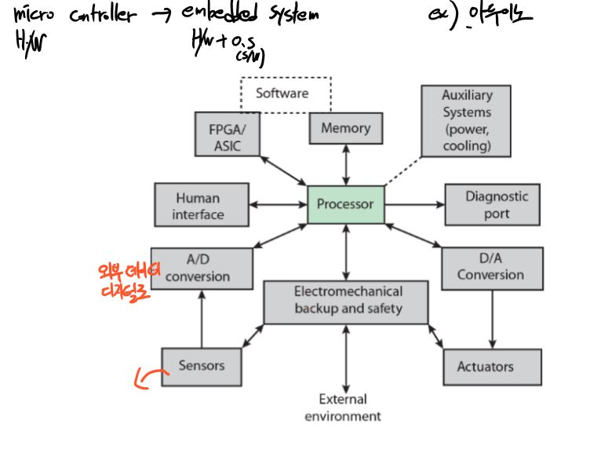

# 컴퓨터 구조 1 - 2장

## 4. 집정회로 제조

### 1. 무어의 법칙
18개월 마다 집적도가 2배 증가. - 집적도 2배증가는 반도체 칩 안의 트랜지스터 개수 2배씩 증가한다는 뜻
* 속도 빨라짐(성능 향상)
* 전력소비 낮아짐
* 소형화 가능
* 불량율 낮아짐(신뢰도 상승)
* 지금까지 하드웨어 발전하면서 가격변동이 크게 없음 

## 5. 임베디드 시스템
내장형 시스템
* 특정 기능을 수행하기 위해 설계된 컴퓨터
* 범용 컴퓨터와 달리 제품 내에서 사용되는 전자장치 및 소프트웨어
* 주변 환경과의 상호 작용을 위해 실시간 제약이 존재함

### 1. 임베디드 시스템의 조직
과거에는 Micro Controller 이라고 부름 (Processor에 가까운 개념) 
임베디드 시스템은 H/W + S/W 포함 되어 있는 기능 

### 2. ARM(Advanced Risc Machine)
스마트폰에 많이 사용함
* 프로세서를 직접 제조하지 않고, 반도체를 설계까지만 진행하고 판다.

## 6. 컴퓨터의 성능 향상(중요)
* 집적률을 높이기
* 클럭률이 올라갈 수록 성능이 향상 (클럭이 높을 수록 속도 향상)
  - 최근에는 클럭률이 올라가지 않음 물리적인 한계에 접목 전기소모와, 스위칭 되는데 시간 한계
  
### 1. 성늉 균형 문제
* 프로세서와 주기억 장치간의 병목 발생

### 2. 프로세서의 속도 향상 방안 (중요)
* 프로세서의 하드웨어 속도 증가
  * 논리 게이트 크리를 줄이고, 게이트를 조밀하게 넣어 클럭의 속도를 높인다.
* 프로세서 - 주 기억장치 사이의 캐시크기와 속도 증가
* 명령어 실행 속도를 높일 수 있도록 프로세서 조직과 구조를 변경
  * ex) 파이프라이닝,수퍼스칼라 (병령성 처리 제공)
  
### 3. 멀티코어
싱글코어도 명령어 에서 병렬성을 제공할 수 있긴함 그러나 멀티코어는 프로그램 자체를 분할해서 실행하는 병렬성을 제공
* 큰 용량의 캐시를 공유하는 여러 프로세서를 하나의 칩에 배치
* 멀티코어가 내부 구조가 트랜지스터의 개수는 비슷해도 내부 주조가 간단해서 코어들이 일을 처리 하는것이 빠르다.
* 코어의 개수 만큼 성능을 향상

## 7. 컴퓨터의 성능 평가
성능, 가격, 크기, 전력, 소비, 신뢰도 - 관점에 따라 성능을 평가하는 방향이 다 다르다.

### 1. 관점에 따른 컴퓨터 성능 평가
* 사용자 관점 - 응답시간 컴퓨터가 일을 완료하기까지 걸리는 시간 중요
* 시스템 관점 - 처리량 대역폭이 중요함
  * 대역폭 : 일정한 시간 동안 처리하는 작업의 양

### 2. 성능의 정의

