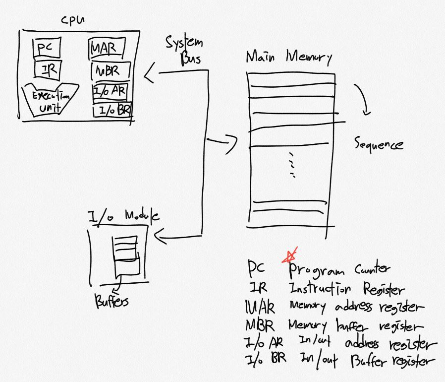
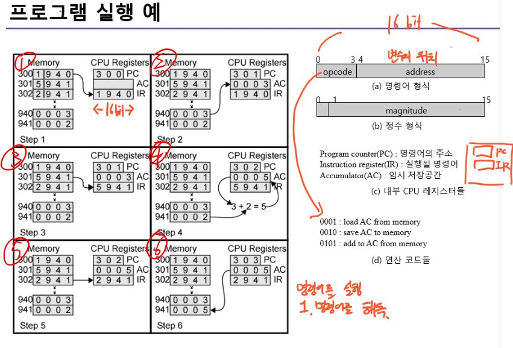
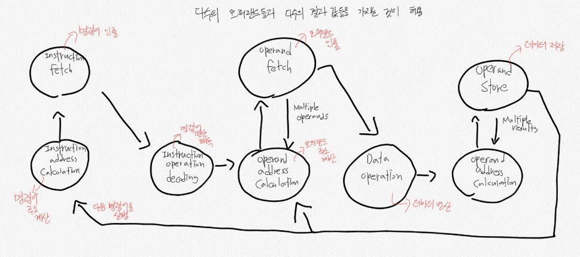
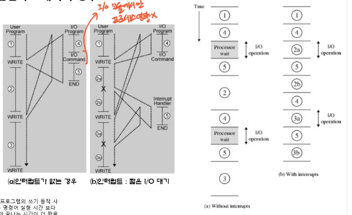
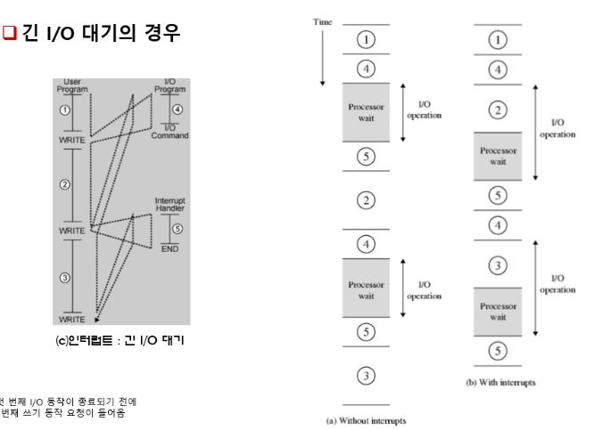
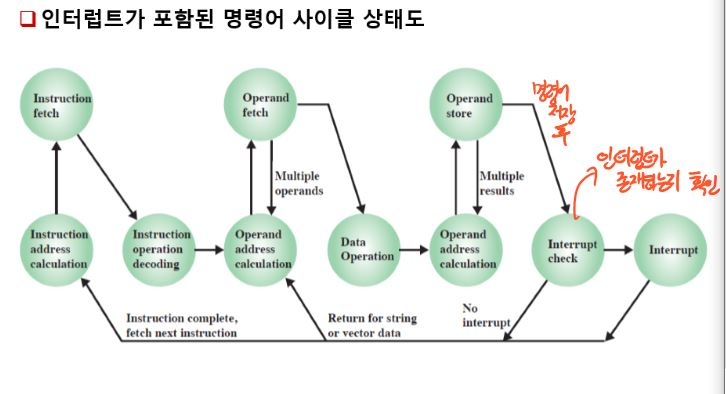
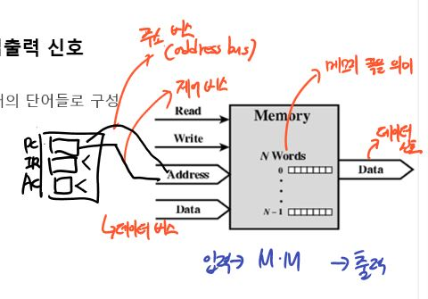
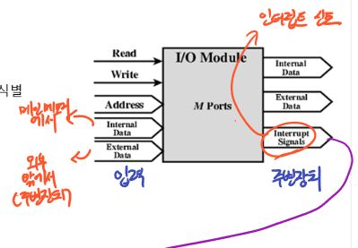
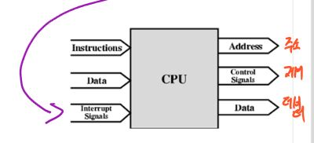

# 컴퓨터 구조 2장

## 1. 컴퓨터의 구성 요소
컴퓨터의 구성 요소와 상호 간의 작용 

* PC(Program Counter) - 기억장치로부터 읽혀질 다음 명령어 주소 저장
* MBR - 기억장치에 저장될 단어를 가지고 있거나, 기억장치로 부터 읽혀진 다음 단어를 저장하는데 사용
* MAR - MBR로부터 쓰여지거나 읽혀질 단어의 기억장치 주소를 저장
* IR - 실행될 명령어 연산코드를 저장 
<a>Register - 임시로 데이터를 저장하는 기억장치 메모리</a>
### 1. 동작 순서
1. CPU는 RAM에 있는 메모리를 교환한다.
1. PC가 첫 번째 명령어 주소인 X를 가지고 있다.
1. PC에 있는 주소가 MAR로 적재
1. 이때, MAR에 있는 주소가 Main memory주소를 가리킨다.
1. 그 주소에 해당하는 값을 MBR에 저장
1. 해당하는 값을 IR에 전달한다.( 다음 주소를 읽기 위해 PC가 한개 증가)
1. 제어장치가 명령어를 해독후 AC에 data를 저장하거나 연산

## 2. 컴퓨터의 기능
주기억 장치에 저장된 데이터를 기계 명령어로 실행한다.

### 1. 명렁어 처리
**명령어 사이클**
* 인출 Fetch - 명령어를 CPU로 가져온다.
* 실행 Execute - 가져온 명령어를 실행한다.

**명령어 인출과 실행**
1. PC(Program counter) - 이 레지스터에 있는 값이 다음의 실행할 명령어의 위치를 가지고 있음 (중요)
2. PC에 저장된 주소값의 명령어를 CPU안의 IR로 저장함.
3. IR에 저장된 명령어를 해독 해야함.
* AC - 중간 산술 논리 장치 결과가 저장되는 레지스터이다.
4. PC는 명령어를 가져오자마자 다음 주소값으로 변경 된다.

### 2. 프로그램 실행 순서 예시
 
940 번지의 내용을 941 번지의 내용과 더하고 결과를 941 번지에 저장 하는 것.
1. PC는 첫 번째 명령어 주소 300을 가지고 있다. 이 명령어는 IR로 적재되고, PC는 증가 된다.
2. 명령어 해독 과정에서 1940 이라는 명령어에서 맨앞 1은 opcode로 (16진수는 0001)명령어를 실행. 나머지 940은 메인메모리 상의 주소 이므로 940 번지에는 0003의 데이터 가있는데 이 데이터를 AC에 저장한다.
3. 다음 주소 명령어 (5941)이 301번지로 부터 인출되어 IR에 저장되고 PC는 증가 된다.
4. 명령어 해독 결과 5|941 은 5(0101) add to AC from memory로 941번지 데이터와 AC 메모리의 데이터를 저장한다
5. 다음 명령어(2941) 를 불러오고 PC증가
6. 2941 은 2(0010) save AC to momory이므로 941번지에 AC값을 저장한다.

### 3. 명령어 상태도
 
위의 프로그램 실행 순서와 같이 보면서 해석

### 4. 인터럽트(Interrupt)
다른 모듈(외부장치) 프로세서의 정상적인 처리(명령어상태도대로 문제 없이 진행)를 방해하는 것
* CPU의 효율이 향상된다 - 그 이유는 CPU를 쉬지않고 일을 시키기 위해 인터럽트를 두어서 다른 명령어를 실행

 정리 - I/O 모듈의 인터럽트 신호를 보내서 CPU가 다른 모듈이 연결될 때 그 일이 수행되면서 대기시간이 생기는 것을 방지하기 위해 연결된 모듈이 일을 수행하는 동안 CPU는 다른일을 처리하고 외부 모듈이 완료되면 인터럽트 신호를 보내어 효율성을 높인 다. 
 

* a의 경우 - 1 > 4 > I/O Operation > 5 > 2 > 4 > I/O operation>5 > 3 (I/O 실행 하는 동안 대기 해야함) 
* b의 경우 - 1> 4 > 2a > 5 > 2b > 4 > 3a > 5 > 3b (대기가 없음)

**긴 I/O 대기의 경우**
 
1 > 4 > 2 (I/O의 동작이 길어 종료되기 전에 두번째 쓰기 동작에 도달) > 프로세서 waiting > 5 > 4 > 3 > 외부 모듈 실행이 길어 대기 > 5

#### 1. 인터럽트 사이클
프로세서는 인터럽트 신호를 조사하여 인터럽트의 발생 여부를 검사한다. 만약 대기 중인 인터럽트가 없다면, 실행중인 다음 명령어를 실행한다.
  인터럽트가 대기중일시
* 현재의 프로그램 실행을 중단하고 문맥을 저장한다.
* PC에 인터럽트 처리기(Interrupt handler) 루틴의 시작 주소를 세트한다.

#### 2. 인터럽트 포함된 명령어 사이클
 

* **인터럽트 발생시 현재 PC의 주소는 메인메모리 어딘가 저장해야 된다 .**

#### 3. 다중 인터럽트
 * 순차적 인터럽트 처리
  * 인터럽트 처리중 다른 인터럽트 처리 불가능
  * 발생한 인터럽트는 대기 상태에 있다, 가능 상태가 되면 프로세서에 의해 처리
* 우선 순위에 따른 인터럽트 처리
  * 인터럽트에 우선순위를 매겨, 순위가 높은 것 대로 처리
  * 예를들어) 프린트모듈 말고 더중요한 외부 모듈이 추가되어 인터럽트가 발생되면 그 인터럽트 부터 먼저 처리
  * 2 - 프린터, 4- 디스크, 5- 통신 | 번호가 클수록 우선순위가 높음.
  

## 3. 상호연결 조직
컴퓨터의 프로세서와 메모리들을 연결하는 조직 ex) BUS

### 1. 메모리
 
**입력신호**
* address bus - PC의 주소를 메모리에 있는 주소와 연결되어 있는 통로
* Control Bus - Control unit 의 읽어와라, 써라 제어를 하는 명령을 보내는 통로
* Data bus - Operand 등이 흘러다니는 통로
**출력신호**
* Data

### 2. I/O 모듈
 
* I/O 모듈의 출력신호로 인터럽트 신호를 보낸다 -> CPU로 신호를 들어감.
### 3. 프로세서
 
