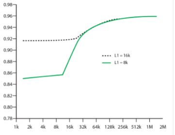

# 캐시 기억장치

## 1. 컴퓨터 기억장치 시스템 개요

### 1. 메모리의 역할
* 프로그램 명령이나 데이터를 저장

### 2. 메모리는 프로그램의 작업장
  * 메인메모리는 현재 실행중인 프로그램들을 저장한다.
  * 메모리의 영역은 서로 침범하지 못하도록 시스템 소프트웨어의 프로그래머가 정함
  
### 3. 용량
* 내부 기억장치 용량은 바이트 또는 Word단위로 표현
* 외부 기억장치는 일반적으로 바이트를 사용.

### 4. 전송 단위
 * 내부 기억장치에서는 데이터 선들의 수(폭) 과 같다.  
 * 외부 기억장치는 단어보다 큰 단위Block으로 전송한다.

**주소지정단위**
* 주소의 길이 A비트 , 주소지정 단위의 수 N개 는 2^A = N이다. 

### 5. 데이터 액세스 방식

* 순차적(Sequential) - 외부기억장치
  * 처음부터 순서대로 액세스를 진행하다가 찾는 방식
  * Ex) 음악 테이프 같은 식, 백업용으로 사용한다고 하심.
  * 레코드가 저장되어 있는 위치에 따라 액세스 시간이 달라짐

* 직접(Direct) - 외부기억장치
  * 하드디스크나, 광학디스크
  * 회전 하면서 안쪽 이나 바깥쪽으로 이동하면서 트랙과 섹터를 찾는 방법
  * 액세스 시간이 위치에 따라 다르다
  
* 임의(ramdom) - 내부기억장치
  * 특정한 데이터를 가리키는 것을 주소 선으로 나타낸 것
  * **위치와 상관없이 액세스 시간은 똑같다.** -> 데이터 위치가 어디에 있든 걸리는 시간이 똑같다.
  
* 연관(Associative) - 캐시에 사용
  * 단어 내의 특정 비트들과 원하는 비트들을 비교하여 일치하는 단어를 액세스 하는 방식

### 6. 성능

#### 1. 액세스 시간
기억장치의 종류에 따라서 액세스하는데 걸리는 시간이 다 다르다.
* 임의 액세스 기억장치
  * 액세스 시간이 모든 기억장치에서 동일하다 ex) 캐시 or 임의 액세스 방식
* 비임의 액세스 기억장치
  * 데이터가 저장되어 있는 위치에 따라 다르다.

#### 2. 기억장치 사이클 시간

#### 3. 전송율
데이터가 기억장치로 전송되어 들어가 나오는 비율
* 임의 액세스 기억장치 = 1 / 사이클 시간 * 버스의 폭
* 비임의 액세스 기억장치에서 데이터 전송에 소요되는 시간 = 평균 액세스 시간 + 비트들수 / 정송률

### 7. 물리적 유형에 따른 기억장치
  * 반도체 : Ram
  * 자기 : 디스크
  * 광 
  
### 8. 기억장치의 물리적인 특징
  * 휘발성 - 주기억장치 : 전기신호가 끊기면 데이터가 사라짐
  * 삭제가능여부 - ROM에 있는 데이터는 삭제 불가
  
### 9. 기억장치 특징들
  * 액세스 속도가 빠를수록, 비트당 가격이 높아짐
  * 용량이 커질수록, 비트당 가격은 낮아짐
  * 용량이 커질수록, 액세스 속도는 느려짐
  * 캐시를 크게 못하는 이유가 동작자체가 느려지는 경향이 있음.(물리적인 한계)
  
예제 4.1 
* 레벨 1은 1,000개의 단어를 저장하며 액세스 시간은 0.01us
* 레벨 2는 100,000 개의 단어를 저장하며 액세스 시간은 0.1us
  
95% 가 레벨1에 있을때 단어를 액세스 하는데 걸리는 시간은?
 
95% X 0.01 + 5% X (0.1 + 0.01) = 0.015 us 시간걸림

### 10. 2단계 기억장치의 성능 개선 원리
* 참조의 지역성
  * 순차적으로 프로그램이 진행된다.
  * 반복 구조는 여러 반복되는 비교적 적은 수의 명령어로 구성
  * 메인 메모리에서 캐시로 데이터를 보낼때 한꺼번에 뭉텅이로 데이터를 보내 원하는 데이터가 인근에 몰려있음.
  
* 공간적 지역성
  * 데이터들이 공간적으로 대게 몰려 있다.
  * 명령어들이 순서대로 실행될 때 공간에 연관 데이터 몰림
* 시간적 지역성
  * 최근에 사용한 명령어를 호출하는 경향이 크다
  
## 2. 캐시 기억장치의 원리

## 3. 캐시 설계의 요소들

### 1. 캐시 주소
* 논리적 캐시(가상 캐시)

  * 프로세서가 캐시에 가서 가상 주소를 이용함
  * MMU(memory management unit)를 이용해 논리적인 주소를 실제주소로 변환해서 나간다.
  * 장점 - 물리적 캐시보단 빠르다
  * 단점 - 다른 영역의 주소들중에서 같은 가상주소를 사용할 수 있음
* 물리적 캐시
* 캐시의 주소가 메인메모리에 보내는 주소가 같다. 

### 2. 캐시 크기
* 캐시 크기의 최소화 이유
 * 캐시 용량이 커질수록 느려지는 경향이 있음
 
### 3. 쓰기 정책
* 연속 기록 방식
 * 모든 쓰기 동작들이 캐시 뿐만 아니라 주기억장치로도 동시에 행하는
* 후 기록 방식
 * 데이터 갱신은 캐시에서만 일어남, 해당 블록이 교체(기존의 캐시를 메모리에서 버리고 기록)될 대 주기억장치를 갱신
 * CPU사이클이 휴식일때 캐시의 내용을 주기억장치에 블록단위로 수시로 백업하면 시스템 성능을 높인다.
 
 ### 4. 라인 크기
 한 개의 데이터를 읽어 캐시에 저장될 때, 인접한 Word들도 같이 읽혀온다.
 * 블록이 커질수록 - 한 번에 데이터를 많이 가져온다
  * 지역성의 원리에 적중률이 커진다. (필요한 명령어 들이 인접해 있기 때문에)
  * 블록이 더욱 커지게 되면 적중률이 감소
  
 * 블록 크기와 적중률 간의 관계
  * 블록이 커질수록 캐시에 들어올 수 있는 블록의 수는 감소.
  * 블록이 커질수록 원하는 단어가 아닌 단어들도 같이 읽혀진다. 이 단어들은 가까운 미래에 사용될 가능성이 낮다.
  
### 5. 캐시의 수
* 온칩캐시(내부캐시, L1캐시) - CPU내부의 캐시
* 외부 캐시(off-chip캐시,L2캐시) - SRAM을 사용하여 DRAM보다 빠름

* L2 캐시와 L1 캐시의 차이

 * L1 이 8K일때 L2 캐시가 12K 일때 성능이 좋아진다
 * L1 이 16K일때 L2가 31K일때 성능이 급격히 좋아진다
 
 * 분리 캐시
  * 명령어 저장하는 캐시와 데이터를 전용하는 캐시를 따로 구성
  * 명령어 와 데이터를 가져올때 겹치지 않아 문제점이 생기지 않는다.
  * 파이프 라인구조에 유리
 * 통합 캐시
  * 명령어 와 데이터 모두 구성되어 균형을 이루고 있다.
  
  

  
## 참고) 메모리 용량
2^10 = 1024개, 10^3 = 1000개
* 윈도우 운영체제는 2진 용량사용
* 하드 업체는 10진 용량 사용

### 엔디언
**0x1234**
* 빅 엔디언 12 34
* 리틀 엔디언 34 12

**0x12345678**
* 빅 12 34 56 78
* 리틀 엔디언 78 56 34 12
* 미들 엔디언 34 12 78 56 

리틀 엔디언은 인텔프로세서 사용, 빅 엔디언은 네트워크 주소 사용
