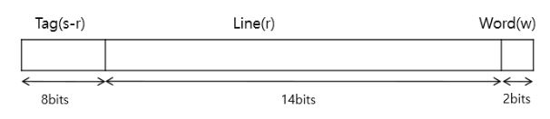
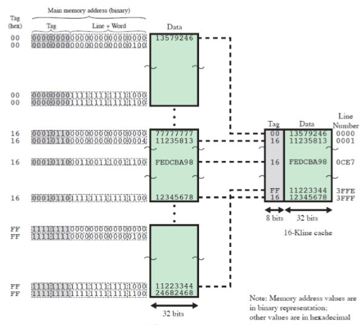
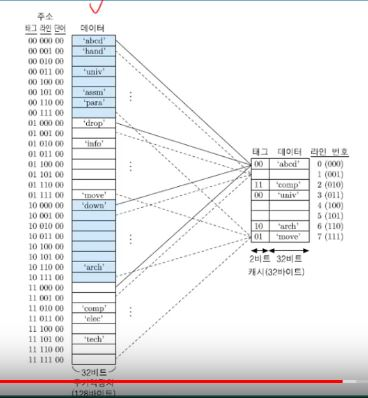
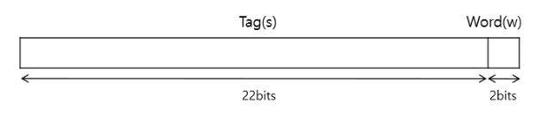
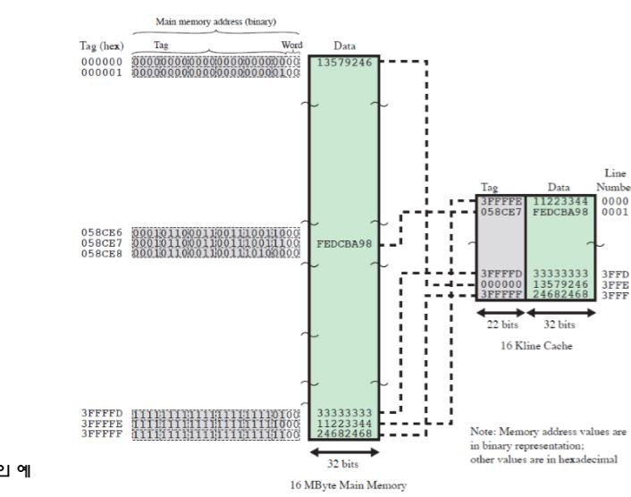
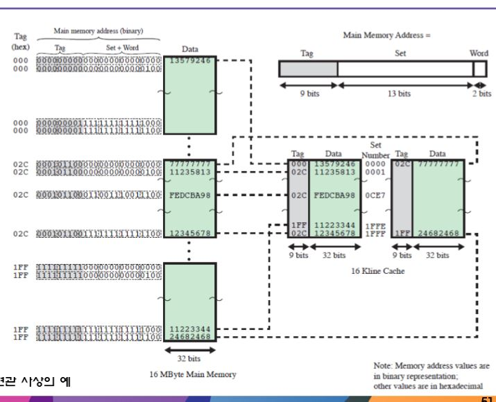

# 3. 캐시 기억장치

## 1. 사상 함수
캐시 라인의 수는 주기억장치의 블록 수보다 적기 때문에 주기억장치 블록을 캐시 라인으로 매핑 해주는 알고리즘 필요

ex)
* 캐시 메모리 64KB 용량 = 2^16 (16비트) 
* 캐시와 주기억장치 데이터 전송은 4Byte-Block 2^2 = 2비트
* 캐시는 총 2^14 개의 4바이트로 구성 16K개
* 주기억장치는 16MB = 2^24 (24비트)
* 주기억장치는 총 2^22개의 4바이트로 구성, 4M개

### 1. 직접 사상
주기억장치의 블록을 한 캐시의 라인으로만 사상.
 
* 한 블럭이(라인) 4바이트 이기 때문에 총 라인의 주소는 총 14비트가 필요

* 주소 길이 = 24bits
* 블록 크기 = 4byte
* 주기억장치의 크기 = 2^24 = 16MB
* 주기억장치의 블록수 = 2^22 = 4M개
* 캐시 내의 라인 수 = 2^14 = 16K개
* 캐시 크기 = 2^16 = 64KB

* 라인이 14비트면 방이 2^14 개라는 것
 
 
* 라인을 읽었을때 태그를 확인하고 일치하면 캐시에서 데이터를 사용하고 일치 하지 않으면 태그+라인으로 주기억장치 주소로 사용해 주기억장치에서 데이터를 가져온다.

**장단점**
* 구조가 간단하고 비용이 적게된다
* 캐시 위치가 고정되어서 적중률이 낮다

### 2. 연관 사상
캐시의 어떤 라인으로 적재 할 수 있도록 허용
 

* 주소 길이 = 24bits
* 블록 크기 = 4Byte
* 주기억장치 내 블록의 수 = 2^22 = 4M
* 태그의 크기 = 22bit, s비트

 
* 캐시에서 데이터를 찾을때 태그를 병렬로 뿌림.

**장단점**
* 새로운 블럭이 캐시로 읽혀질 때 교체에 있어 융통성이 있다.
* 캐시 라인을 병렬로 검사할 복잡한 회로가 필요.

### 3. 세트 연관 사상
캐시를 여러개의 세트들로 나누어, 각 세트들은 여러 개의 라인들로 구성

m = v X k  
 i = j modulo v  
* i = 캐시세트 번호
* j = 주기억장치 블록 번호
* m = 캐시 내의 라인수
* v = 세트 내의 수
* k = 세트의 수 k-way세트연관

* k = 1, v = m 이면 직접사상이다.
* k = m , v = 1 이면 연관사상이다

 
* 2-way세트 연관 사상이라 캐시의 같은setNumber에 2개의 데이터들이 존재하며 이는 태그로 구별한다

### 4. 교체 알고리즘
캐시가 채워진 뒤에, 새로운 블록을 캐시로 가져올때 현재 캐시의 저장되어 있는 블록중 하나는 교체 되어야함
#### 1. 최소 최근 사용(least recently used : LRU)
* 사용하지 않고 가장 오래 있었던 블록 교체
 
#### 2. FIFO
* 캐시 내에서 가장 오래 머물렀던 블록 교체
* 라운드 로빈, 기법 구현

#### 3. 최소사용빈도(least frequently used:LFU)
* 가장 적게 참조되었던 블록 교체

### 5. 쓰기정책

#### 1. 연속기록(Write through)방식
* 쓰기를 진행할때 캐시 뿐 아니라 주기억장치도 동시에 행해지는 경우

#### 2. 후 기록(write back) 방식
* 데이터 갱신은 캐시에서만 일어나고, 해당 블록이 교체 될 때 주기억장치도 갱싱
* CPU기계가 쉴때 캐시의 내용을 주기억장치에 수시로 백업하며 성능을 높일 수 있음.
