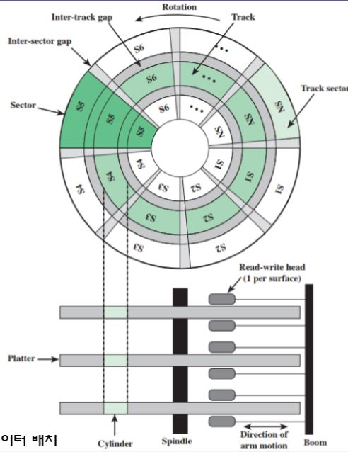
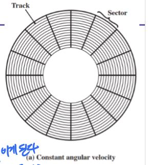
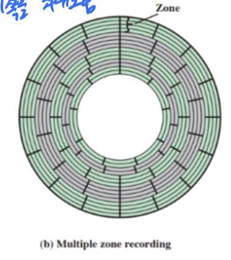
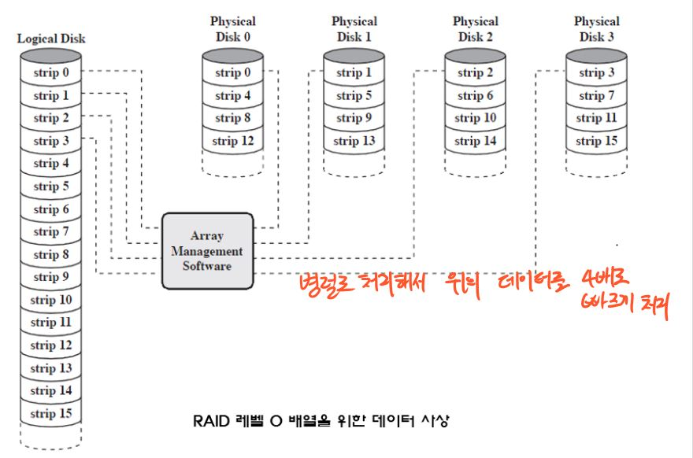
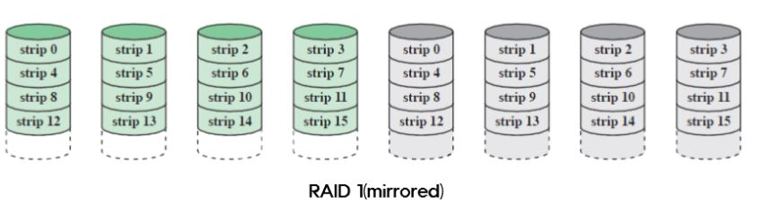
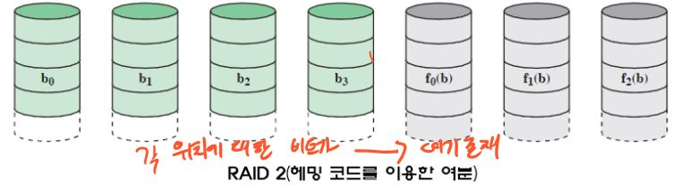
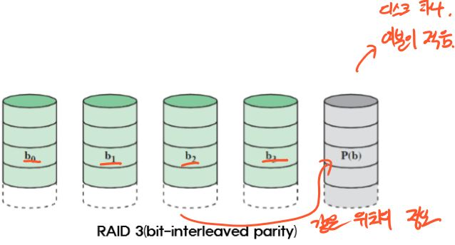
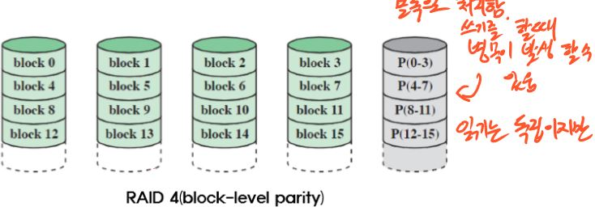
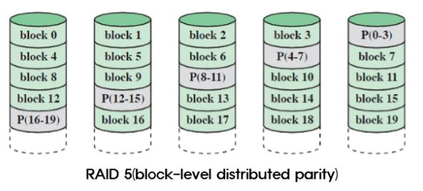
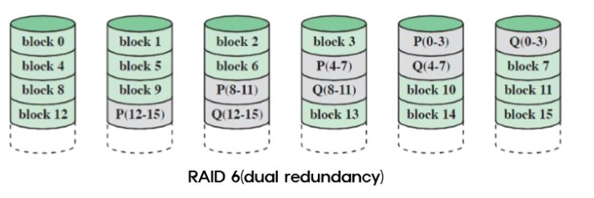

# 외부 기억장치

## 1. 자기 디스크
* 디스크 - 자성물질로 코팅된 비자성 물질로 만들어진 원형 판
* 자기적 읽기 및 쓰기 메커니즘
  * 쓰기 메커니즘 - 코일에 전기가 흐르면 자장이 발생을 이용
  * 읽기 메커니즘 - 자장내에 코일이 이동며 코일에 전류가 발생을 이용
  
### 1. 데이터 조직과 형식화
* 트랙 - 디스크의 데이터 기록되는 곳
* 섹터 - 디스크로 들어오거나 나가는 데이터의 전송단위, 트랙은 섹터라는 단위들로 나누어져 있음.
* 갭 - 인접한 트랙 분리
 

### 2. 디스크 배치 방식
* 등각 속도
 
  * 바깥쪽으로 갈수록 저장된 정보들의 비트들 간격을 증가
  * 디스크 안쪽 저장용량이 바깥쪽 보다 작은데 바깥쪽도 안쪽에 맞춰 안쪽을 최대로 용량을 정함
  
* 다중 영역 기록
 
  * 트랙마다 같은 비트 밀도를 갖는다.
  * 동작 회로가 복잡해지나 저장 용량을 늘릴 수 있음.
  
## 2. RAID(Redundant Array of Independent Disks)
프로세서 속도와 디스크 속도 차이를 줄이기 위해 제안
* 여러 개의 디스크를 하나의 디스크 처럼 사용하여 중복된 데이터를 나눠서 저장 하는 기술
* 병렬 동작으로 디스크 배열

### RAID 0
* 여분의 디스크가 없다.
* 에러가 발생하면 복구할 수가 없음
 
* 데이터를 중복해서 저장하는 것이 아니라 입출력은 빠르다.

### RAID 1
* 모든 데이터들을 여분의 디스크에 복사하여 저장함.
 
* 읽기는 두 디스크중 빠른 쪽을 사용, 그러나 쓰기는 두 디스크에 모두 해줘야한다.

### RAID 2
* 병렬 액세스 기법 사용 - 각 I/O 요구처리에 모든 디스크 참여
* 작은 크기의 스트립 사용(바이트, 워드)
* 오류 정정을 위해 각 데이터 디스크에 대응되는 비트들에 대해계산
  * 그래서 Raid3 보다 여분이 많다(많이 사용)
 

### RAID 3
* RAID 2 와 비슷 병렬 액세스 기법
* 작은 크기 스트립
* 요류 정정을 같은 위치에 있는 패리티 비트를 사용해서 따로 저장한다.
 

**RAID4부터 독립적으로 처리하고 블럭 단위로 스트립 단위가 커짐**

### Raid 4
* 독립적인 액세스 기법
* 스트립들이 상대적으로 크다(블럭)
* Raid 0에 백업용 하드 디스크를 하나더 붙임
 
* 읽기는 상관 없지만 쓰기를 할때 한 디스크 이기 때문에 병목현상이 발생 할 수 있음.

### RAID 5
* 패리티 정보가 모든 디스크에 분산 저장을 한다.
* 나머진 RAID4와 유사한 방식
 

### RAID 6
* 패리티 정보가 두 가지로 이루어져서 오류 정정이 더 강력하다.
* 디스크 2개 고장나더라도 복원 가능
 
