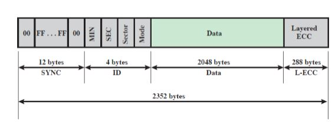
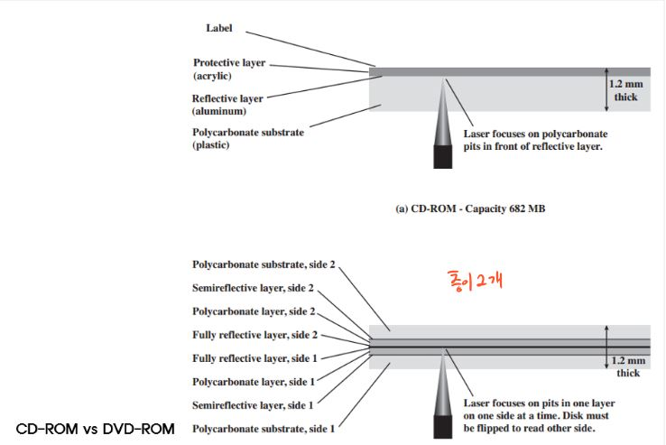
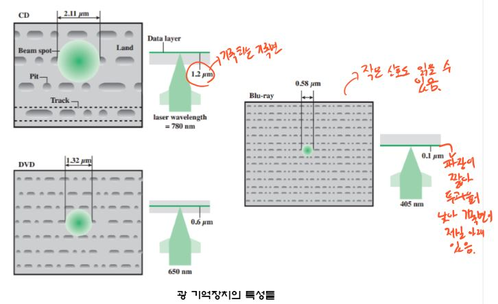

# 외부 기억장치

## 3. Solid state Drive(SSD)
* 데이터를 저장하기 위한 기억장치로 반도체 메모리를 이용하는 저장장치
* 플래시 메모리 사용
* R/W, Head, 구동장치가 없음.

### SSD의 현실
* 장치를 사용할 수록 SSD성능의 저하
    * 플레시 메모리는 소모성
    * 시간이 지날수록 가상기억장치 동작으로 인해 조각화 발생
* 쓰기의 한계가 존재
    * 쓰면 쓸수록 산화막에 손상이 발생, 저장된 전자의 양을 판단하기 힘들 수 있음.
    
## 4. 광 기억장치
* 광학 디스크
    * 투과면 - 레이저 광선을 쏘아 투명기판 통과
    * 기록면 - 반사하는 빛의 반사량 차이로 1과0 구분
* 광학 디스크의 회전 방식    
    * 등선속도 - 드라이브의 속도가 달라짐(어느때는 빠르고 어느때는 느림), 안쪽과 바깥쪽을 읽을때 모터가 회전하는 속도가 달라짐
    * 등각속도 - HDD, 드라이브 속도가 일정함, 소음이 적음
    
### CD-ROM
* 데이터를 저장할 수 있는 CD-ROM은 오류정정 기능이 포함되어 있음, 음악을 저장하는 것은 오류정정 없음
 
* SYNC - 새로운 주소가 시작되는 위치를 알려줌
* ID
* DATA
* L-ECC - 에러정정
 

* CD-Recordable 공CD
* CD-Rewritable 기록하고 삭제 가능

### 광 기억장치 비교 특징
 
 
* 레이저가 점점 작아져서 더 많이 기록할 수 있음
* Blue-ray 작은 신호도 잘 읽을 수 있음.
* 기록면이 CD는 위에, DVD는 중간, Blue-ray같은 경우 맨아래인 이유는 파장이 짧아 투과율이 낮아 기록면에 직접 쐬줘야함.

## 5. 자기 테이프
* 병렬 기록 - 테이프의 데이터가 길이 방향으로 나열된 다수의 병렬 
* 직렬 기록 - 하나의 트랙을 따라 비트들이 순차적으로 배치
